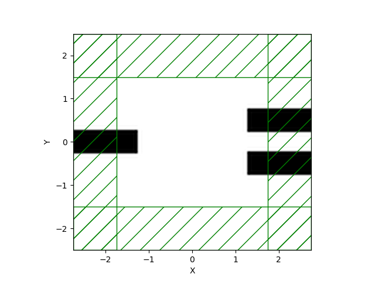
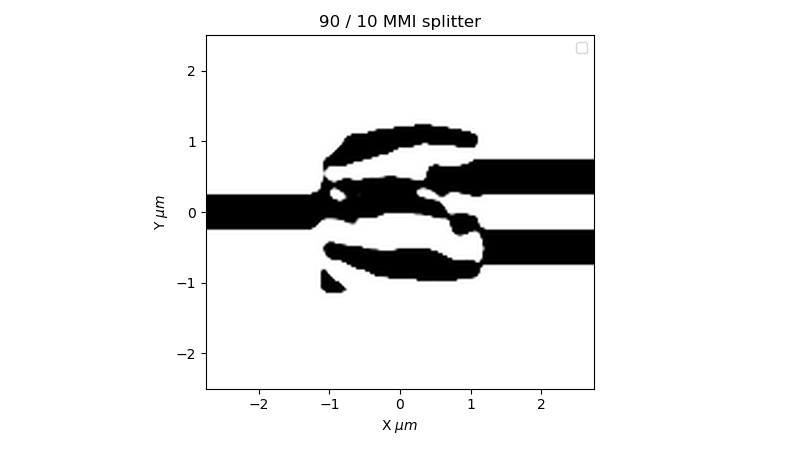
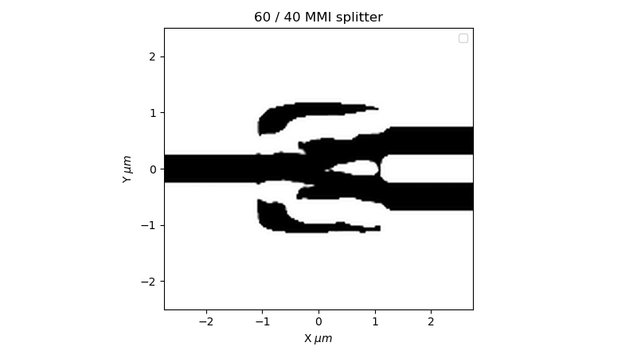
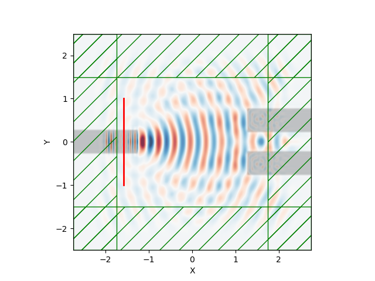

# inversedesign

Adjoint-based **topology optimization (inverse design)** of a silicon photonic **MMI (multimode interference) splitter** using MEEP's `meep.adjoint` module, targeting an asymmetric power split ratio (e.g. 90:10, 60:40) near 1550 nm.

## Overview

In this repo I used inverse design algorithms to optimize for different beamsplitting power ratios in a small 2x2 µm area. 90:10 and 60:40 splitting ratios were optimized for high power transmittance in a small footprint.

Rather than hand-designing a splitter geometry, the device's permittivity distribution inside this free-form design region is treated as the optimization variable. Gradients of the objective with respect to every pixel in that region are computed efficiently via the **adjoint method** (one extra simulation per frequency, regardless of the number of design parameters), then fed to the NLopt MMA gradient-based solver. Simulations were performed with MEEP, the open-source FDTD solver.

The code uses a multi-step beta approach where we use a tanh projection of the weights to model the physical constraint of keeping features above 50nm. This is done to explore the design space while achieving physical designs and iteratively decreasing feature size:
- a **conic spatial filter** enforces the minimum feature size (50-90 nm depending on the run), and
- the **tanh projection** sharpness parameter `beta` follows a **continuation/beta-scaling schedule** — starting near 1 and geometrically scaled up (e.g. x1.2-x1.5) across ~15-25 stages, each running ~100-320 solver iterations. Early stages with low `beta` give a smooth, easily-optimized "gray" landscape; later high-`beta` stages push the design toward a crisp binary Si/SiO2 layout without getting stuck in local minima.

An example 60:40 beamsplitter simulation:

_field.gif)

### Design region geometry preview

### Figure of merit vs. iteration (90:10 splitter, opt 11)

.png)

### Optimized 90:10 splitter

### Optimized 60:40 splitter

### Forward field through the optimized device

### Field propagation animation

_field.gif)

### Transmission spectrum of the converged 90:10 design

_spectra.png)

## Core workflow

- **`MMIsim.ipynb`** — Main notebook for the design workflow:
  - Defines the simulation cell, a 2.5 µm x 2.5 µm `MaterialGrid` design region (Si/SiO2), and the input/output waveguide geometry (one input arm, two output arms with configurable separation).
  - Runs density-based topology optimization with the NLopt MMA solver, using a conic filter + tanh projection (`mapping`) with a continuation schedule over the projection sharpness `beta`.
  - Objective function `J` targets a power split ratio (e.g. 90:10) between the top and bottom output arms, evaluated over a broadband frequency sweep (1.5-1.6 µm).
  - Saves each optimization run's design weights, objective history, and parameters to `opts/optresult(N).npz`.
  - Loads a saved design, applies it to the `MaterialGrid`, and runs a verification simulation, saving field data to `outputs/`.

- **`adjoptmpi.py`** — MPI-parallelizable script version of the same adjoint optimization loop (for running on multi-core/cluster resources outside the notebook), currently configured for a 90:10 splitter at resolution 30 with a 50 nm minimum feature size.

## Post-processing scripts

- **`transmission_spectra.py`** — Loads a saved `optresult(N).npz` design, rebuilds the geometry, and computes broadband transmission spectra (1.35-1.75 µm) via a two-run (reference waveguide vs. design) flux normalization. Outputs plots to `spectra/`.
- **`field_video.py`** — Animates the Ez field propagating through an optimized design, overlaid on the device geometry, producing a GIF (e.g. `Ez_opt.gif`, `optresult(N)_field.gif`).

## Results

- **`opts/`** — Saved optimization results (`optresult(0..12).npz`, `optimal_design1.npz`). Per `opts/notes.txt`, all designs through `optresult(11).npz` use a 90 nm minimum feature size.
- **`spectra/`** — Transmission spectra plots and data for selected designs (currently optresult(6) and optresult(11)).
- **`outputs/`** — Raw HDF5 field/epsilon data from verification simulations.
- Top-level images/GIFs (`90_10.png`, `60_40.png`, `geometry.png`, `Efield.gif`, `Ez_opt.gif`, `FigM(opt9/11).png`, `forward_Ez.png`, `optresult(*)_field.gif`) — figures of merit, geometry previews, and field animations from various optimization runs.
